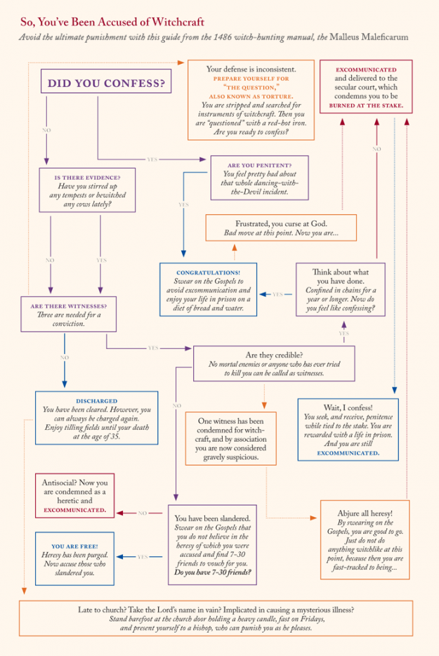

# Coding 101


## What is coding?

(Parts of this introduction to coding are adapted from a [presentation](https://gitpitch.com/ZoeLeBlanc/Coding_101) by Zoe LeBlanc and the UVa Scholars' Lab)

A little less this...


... and a little more this...


### What is a computer even?

[Paul Ford **What is Code?**](https://www.bloomberg.com/graphics/2015-paul-ford-what-is-code/#lets-begin)

### Binary/0 & 1

- Way of counting, just like our way of counting that uses the digits 0-9
- Turns our commands into machine readable language
- ["Bits, Bytes, Building With Binary" by Vaidehi Joshi, BaseCS Blog](https://medium.com/basecs/bits-bytes-building-with-binary-13cb4289aafa)

### So, what is code?

- Code tells a computer a set of commands that you want the computer to execute
- Code can be written in many different programming languages
- Code is translated into binary through a compiler or an interpreter and a computer reads the binary

### Women are coders, too


In fact, the first computer programmer was a woman: Ada Lovelace.

- [Albert Palka, "The Untold History of Women in Software Development"](https://medium.com/codequest/the-untold-history-of-women-in-software-development-299ddc80dd80)
- [Betsy Morais, "Ada Lovelace, the First Tech Visonary"](https://www.newyorker.com/tech/annals-of-technology/ada-lovelace-the-first-tech-visionary)
- [Laura Sydell, "The Forgotten Female Programmers Who Created Modern Tech"](https://www.npr.org/sections/alltechconsidered/2014/10/06/345799830/the-forgotten-female-programmers-who-created-modern-tech)


## What is Python and how do I use it?

- Python is the programming language we're going to be learning today. It was created in 1991 by Guido van Rossum
- It's named after Monty Python
- It's used for a wide range of programming, from making web apps to data analysis

### Why Python?

"Python is almost always the second best language for any problem"


### How do I use Python?

One of the things that's great about Python is that's it's easily readable and understandable for humans. But, as we've discussed, computers don't understand language--they understand `0's` and `1's`. In order to run a program you've written in a high-level language like Python, you need an intermediate program to convert your source code into binary code that the computer can understand. This program is called an *interpreter*.

You can install Python and an interpreter on your own computer (if you're using a Mac, you already have both Python and an interpreter), but there are a number of steps involved. Because we want to get started right away, we'll be using an online interpreter. This allows you to write and run Python code without installing it on your own computer. We'll be using [repl.it](https://repl.it/).

## Let's get started

First, we need to set up our programming environment. Log in to [repl](https://repl.it/) using the username and password you set up earlier. Click on the red plus sign in the lower right hand corner, and then choose "Python" from the list. Give your repl a name ("Coding 101" should work). You're ready to go!

To write a program, you need to give the computer instructions in a format that it understands--in this case, the syntax for Python. Python has built-in functions that you can use to do almost anything you could imagine. But one of the most basic, and important, functions is to print something to the user's display.

`print()`

Whatever you enter between the parentheses is what will be printed for the user (there are some rules, but we'll get to those later). If you want to print words (what we'll call a *string*), then you need to surround those words with quotation marks.

### Try it out

Write your first program by copying the following code into your interpreter and clicking "Run":

`print("Hello, world!")`

Congratulations, you've written your first code!


### Saving your code

We'll be running all of our code in the repl interpreter, and saving our programs to repl. But a Python script looks the same whether it's on repl or on your computer: it's a plain-text file of commands in Python, with a filename that ends in `.py`. In repl, you can create a new file by clicking on the "New file" button and giving your file a name.

### Try it out

Create a separate Python script called `hello.py` with the code we wrote above.

## Variables and data types

Printing is great, but it's only going to get you so far. You're probably going to want to save and manipulate information--names, ages, favorite animals, secrets, weaknesses, and so on. We save information to variables. To create a variable in Python, all you have to do is give it a name and declare its value using an equals sign.

`greeting = "Hello, world!"`

Once you've created a variable, you can use the variable name to access its content.

`print(greeting)`

Notice that we didn't need quotation marks around `greeting`. That's because `greeting` is a variable, and can be called without using quotation marks. In our earlier `print` statement, we were printing a *string*, which requires quotation marks. As we noted earlier, a set of characters other than numbers is called a string. Strings need to be surrounded by quotation marks, and can contain any type of character, including letters, numbers, spaces, and special characters.

```
numone = "one"
numtwo = "two"
numthree = "three"

print(numone)
print(numtwo)
print(numthree)
```

Strings aren't the only kind of data type. You can store and manipulate numbers using two data types: *integers* and *floats*. An integer is a whole number, positive or negative, and a float is a number that includes a decimal.

```
numone = 1
numtwo = 2.2

print(numone)
print(numtwo)
print(numthree)
```

What happened to the strings we stored in `numone` and `numtwo`?


When we reassigned the variables, we erased the strings that were stored there.

Not sure what kind of data you have stored in a variable? Use the `type()` method. If you input a variable, `type()` will output the type of data stored in that variable.

```
print(type(numone))
print(type(numtwo))
print(type(numthree))
```

### Joining variables

You can join variables together using the `+` sign. If your variables are integers and/or floats, the `+` operation will add them together:

`print(numone + numtwo)`

But what if one of your variables is a float or an integer and the other is a string? You can't add letters and numbers.

`print(numtwo + numthree)`

Nope, you can't. You can, however, join two strings together. This is called *concatenation*.

```
name = "My name is Sabrina."

print(greeting + name)
```

Why isn't there a space between the two sentences?

Concatenation joins variables exactly as they are. If there isn't a space in the string, then there won't be a space in the concatenated string.

### Try it out

Add a space between "world!" and "My". Then save the concatenated sentences to a new variable called `full_greeting`.

### Naming variables

What happens if you try to use a number for your variable?

`1 = 1`

You'll get a syntax error! That's because Python has rules for how to name variables.

- A variable can have a short name (like x and y) or a more descriptive name (age, carname, total_volume)
- A variable name must start with a letter or the underscore character
- A variable name cannot start with a number
- A variable name can only contain alpha-numeric characters and underscores (A-z, 0-9, and _ )
- Variable names are case-sensitive (age, Age and AGE are three different variables)

So our previous example could work if we changed the variable name to:

`one_1 = 1`

## Input 

So far, we've assigned values to variables ourselves. But what if we want to let the user input what a variable should be? 


Python has a built-in function for getting input from the user: `input()`

To use the input function, you'll have to assign the answer the user generates to a variable:

`answer = input()`

You'll also want to print a statement that tells the user what kind of information to input. For instance:

```
print("How much wood could a woodchuck chuck if a woodchuck could chuck wood?")
answer = input()
print("A woodchuck could chuck " + answer + " much wood.")
```

### Try it out

In a file called `greeting.py`, write a program that asks the user for their name and then greets them using their name.

## Arithmetic

We've already determined that Python will do basic arithmetic: if you add two floats or integers using the `+` sign, you'll get their sum. You can do other basic math, as well using `-`, `/`, and `*`. If you want to get fancier, you can import the `math` module, which will give you access to a wide range of functions, including trigonometric, logarithmic, hyperbolic, and other kinds of functions. For today, though, we're going to stick with basic arithmetic.

You can perform arithmetic on variables, or you can perform arithmetic on numbers and save the answer to a variable:

```
num1 = 75
num2 = 52
print(num1 + num2)
sum = num1 + num2
print(sum)
product = 683 * 6013
print(product)
```

### Try it out

The Spellmans are buying a new TV. The last one was way too small for their enormous, creepy mansion. Create a new file called `tv.py` and write a program that helps them choose the right TV by asking how far the distance between the couch and the TV will be and returning the best screen size.

What you need to know:

The formula to determine the right size TV is TV = D/2.5, where TV is the ideal screen size and D = distance in inches


## Working with strings

We've already learned one way to work with strings: we can concatenate them using `+`. Python has lots of other methods for manipulating strings: we can convert from upper to lower case or vice versa, search a string for a specific value, split a string into parts, and [much more](https://www.w3schools.com/python/python_ref_string.asp).

### Functions, methods, and dot notation

In order to use string methods, we need to understand a little bit about what a method is, and how it's different from a function.

So far, we've used several Python methods and several functions. Functions and methods are both bundles of code that we can use. Some are built in, and some are user-defined (more on that part later). For our purposes, functions and methods are pretty similar, but there are some differencs that affect the way we use them. Functions are indendent, while methods are associated with objects (usually variables). `print()` and `input()` are functions--you can call them using their names and you don't need to associate them with any other objects. `type()` is a method: it requires an object to run, in this case, a variable whose type you want to determine.

When you use `type()`, you pass a variable into the parentheses. Other methods are structured using *dot notation*. To use these methods, you append the object the method will operate on before the method using a dot. For instance, the `lower()` method converts a string to lowercase.

```
lowered = "MAKE THIS STRING LOWERCASE".lower()
print(lowered)

upper = "THIS VARIABLE CONTAINS AN UPPERCASE STRING"
lowered2 = upper.lower()
print(lowered2)
```

You'll notice that string methods will work on both a string that you define (the first example), or on a variable that contains a string (the second example).

### String methods

A few handy string methods:

```
capitalize() | Converts the first character to upper case
lower() | Converts the string into lower case
upper() | Converts the string into upper case
```

For example:

```
var = "this string is all lowercase"
upper_var = var.upper()
print(upper_var)
```


### Parameters

Some string methods require not only an object, but also a parameter. For instance, `replace()` searches a string for a specific value and returns a string where that value has been replaced with another. In order to work, the `replace()` method needs three things: the string it should search and replace (the object), and the search term and the replacement term (the parameters).

```
var = "Double, double, toil and trouble; Fire burn, and cauldron bubble."
newstring = var.replace("bubble", "fizzle")
print(newstring)
```

In this case, the method is `replace()`, the object is the variable containing the string, `var`, and the parameters are the terms that will be searched and then replaced, `"bubble"` and `"fizzle"`.

### Try it out

Sabrina is having a sleepover and is preparing some games. Write a mad libs program for the guests to play and save it as `mad_libs.py`. Ask the user for at least one verb, one noun, and one adjective, and one curse word, and then use those choices to fill in the blanks in a story that the program prints out. Add some drama to the story by printing the curse word in all caps. Use string methods to make sure that all of the words and sentences in your story are properly capitalized.

Extra practice:

Save the final mad libs story to a variable. Ask the user for one word that's in the story, and one that isn't. Replace all occurences of the first word with the second.


## Putting it all together

The Weird Sisters have cursed Sabrina with an unknown and terrible catastrophe that will befall her on her 100th birthday. Write a program that asks Sabrina for her age, converts the input to an integer, and then tells Sabrina how many years she has until the curse kicks in.

What you need to know:

By default, the data stored in a variable by the `input()` function is a string. If all of the characters the user inputs are numbers, you can convert the string to an integer by passing the variable to the `int()` method. For example:

```
print("Give me a number")
answer = input()
new_integer = int(answer)
```


## Conditionals

In coding, as in life, it's helpful to be able to make different choices depending on the circumstances. *Conditional statements* allow us to plan for different possibilities in our code. Python has three conditional statements:

```
if
elseif
else
```

Conditional statements operate like flowcharts: you go in one direction or the other based on whether a statement is true.



### Comparisons

In order to set up conditional statements, we need to be able to compare two values and then take different actions depending on whether the two values are equal. Comparison operators in Python are similar to operators in basic arithmetic, with a few minor changes. Greater than and less than are just what you would think: `>` and `<`. Other comparison operators include:

```
== | Equal
!= | Not equal
>= | Greater than or equal to
<= | Less than or equal to
```

You can use comparisons in conditional statements like so:

```
num1 = input("Pick a number ")
num2 = input("Pick another number ")
if num1 == num2:
	print("Those numbers are the same!")
else:
	print("That's nice")
```

You'll notice a few new additions to that code: colons and indentation. In Python, a colon introduces a block of code that operates inside another piece of code (much like we used `<` and `>` in HTML, or `{` and `}` in CSS). In addition, the section of code that's nested inside the code is indented. The indentations help us read the code and recognize the nested portions. They're also required for the code to run. Most text editors will help you out and indent your code for you following a colon.

### Try it out

Mad libs was a hit, but the guests are getting restless. Write another story, but this time, give the user more control by letting them choose their own adventure. The adventure doesn't *have* to be scary, but that's always an added bonus.


## Loops

In programming, it's okay to be lazy. It's encouraged, even. Why type something when you can copy and paste? Often, we want to perform an action multiple times inside a program. We could copy and paste bits of code multiple times, but that would be extra work, and would make our code harder to read. Instead, we use *loops* to complete the same task multiple times.

*For* loops are generally used when you have a block of code you want to repeat a fixed number of times. For example:

```
for x in range(5):
	print(x)
```

The `range()` function returns a sequence of numbers, starting from 0 by default, and increments by 1 (by default), and ends with a specified number. If you don't want to start with 0, you can input a different starting-point:

```
for x in range (7, 21):
	print(x)
```

You can also tell the function to iterate by a number other than 1:

```
for x in range(10, 50, 5):
	print(x)
```


### While loops

Sometimes, rather than running a loop a set number of times, we want to run a loop while a condition or set of conditions is true. In that case, we use a *while* loop. We can use a while loop to iterate in a different fashion from a for loop:

```
i = 1
while i < 10:
	print(i)
	i += 1
```

`i += 1` is a way of iterating `i` such that every time the program comes to that line, it reassigns `i` to equal `i + 1`.

The example above is still looping over a specified range of numbers. But we can also write a loop that repeats as long as a certain condition is met, or until a certain condition is met.

```
answer = "teal"
while answer != "purple":
	answer = input("What's your favorite color? ")
```

Right now, when the loop is completed, it just ends. But what if you want to take a different action when the loop is over?

```
answer = "teal"
while answer != "purple":
	answer = input("What's your favorite color? ")
else:
	print("You finally go the right answer!")
```

### Try it out
Sabrina is casting a spell that requires her to write out the name of a demon over and over and over and over again. Write a program to automate this part of the spell by asking for the demon's name and the number of repetitions required, and then printing the name the requested number of times.

Extra practice:

Print out an encouraging message for Sabrina when the demon's name has been written the required number of times.


## Putting it all together

Instead of playing Rock-Paper-Scissors, witches play Potion-Curse-Incantation. The rules are the same:

```
Potion beats curse
Curse beats incantation
Incantation beats potion
```

Make a two-player Potion-Curse-Incantation game. Ask the players for their names and have them choose potion, curse, or incantation. Compare the responses and print out a message of congratulations to the winner.


## Lists

## Functions


## Holding pen

### Boolean types

Python has several other data types in addition to strings, integers, and floats. The last data type we'll talk about today is *Boolean*. A Boolean type has only two values, True and False, and a variable that's a Boolean will always be either True or False.

codeacademy order:
- print
- strings and concatenation
- errors
- variables
- arithmetic
- updating variables
- comments
- numbers (integers and floats)
- two types of division/float()
- multi-line strings
- booleans
- valueerror
- strings
- escaping characters
- access by index
- string methods
- lower()
- upper()
- str()
- dot notation
- printing strings
- printing variables
- string concatenation
- explicit string conversion
- string formatting with %

